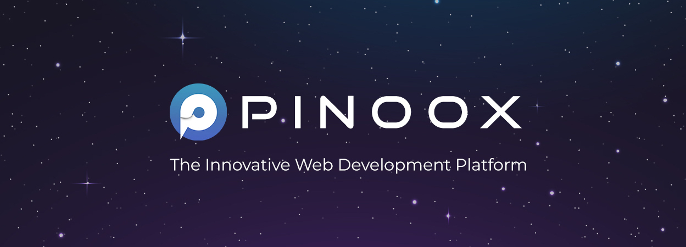

# Pinoox Web Development Framework

Welcome to Pinoox, an advanced web development framework that takes the power of the Hierarchical Model-View-Controller (HMVC) architectural pattern to the next level. With our innovative "App" architecture, which is built upon HMVC, we've simplified, enhanced, and made the process of utilizing HMVC remarkably straightforward, enjoyable, and efficient.

## Getting Started

To get started with Pinoox, follow these steps:

1. Clone the Pinoox repository from GitHub: `git clone https://github.com/pinoox/pinoox.git`

2. Install the required PHP dependencies using Composer: `composer install`

3. Install the required Node.js dependencies: `npm install`

## Key Features

Pinoox offers a wide range of features to empower developers and streamline web development:

- **Modular Development**: Create and manage individual apps within your project for better organization and maintainability.

- **Easy Integration**: Seamlessly connect 'apps' together to build comprehensive web applications.

- **Built-in MVC Architecture**: Enjoy the benefits of the Model-View-Controller architecture in every app.

- **Simplified Maintenance**: Divide and conquer complex projects, making maintenance tasks more straightforward and efficient.

 
## Architecture

Pinoox's architecture is built around the 'app' pattern, which is an enhanced version of the HMVC design. The app pattern allows you to divide your web application into modular components, each following the MVC architecture. This approach promotes code reusability, scalability, and maintainability.

For a deeper understanding of Pinoox's architecture and how 'app' works, refer to our website.

## Contributing

We welcome contributions from the community. If you're interested in improving Pinoox or have ideas to share, please read our [Contribution Guidelines](https://github.com/yourusername/pinoox/blob/main/CONTRIBUTING.md) to get started.

## License

Pinoox is open-source software released under the [MIT License](https://github.com/pinoox/pinoox/blob/main/LICENSE). You are free to use, modify, and distribute Pinoox for both personal and commercial purposes.

---

Join us in revolutionizing web development with Pinoox! If you have any questions or need assistance, please don't hesitate to reach out to our friendly community of developers. Happy coding!
