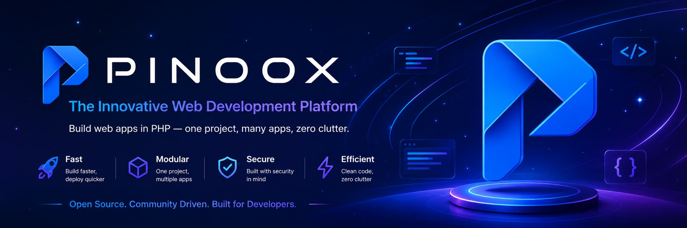

[](https://pinoox.com)

# Pinoox

**Build web apps in PHP — one project, many apps, zero clutter.**

Pinoox is an HMVC platform for PHP 8.2+. You install it once, then add **apps** under `apps/` — each app is a small MVC module with its own routes, database, and theme. Perfect when you want structure without carrying a heavy framework everywhere.

**[Read the documentation →](https://github.com/pinoox/docs)**

---

## Why Pinoox?

| You get | What it means for you |
|--------|------------------------|
| **App-first HMVC** | Split work into `com_your_shop`, `com_your_blog`, etc. — not one giant codebase |
| **Twig + optional SPA** | Server-rendered pages for SEO, or Vue / React / Vite panels when you need rich UI |
| **Built-in CLI** | `php pinoox app:create`, migrations, routes, frontend build — from the project root |
| **JSON API out of the box** | REST-style endpoints with a consistent response shape |
| **Composer core** | Framework lives in `vendor/pinoox/pincore` — your code stays in `apps/` |

### Docker (optional)

Docker packages **Pinoox core and framework infrastructure** (PHP, Apache, MySQL, Node, Composer) plus the three system apps (installer, manager, welcome). Third-party and market-installed apps are not part of the image. See [docker/README.md](docker/README.md).

```bash
cp .env.example .env
docker compose build
docker compose run --rm pinoox composer install
docker compose up -d
```

=======
Use it for company sites, contact forms, internal tools, admin panels, small APIs, and multi-section portals — all in one installation.

---

## Quick start

```bash
git clone https://github.com/pinoox/pinoox.git
cd pinoox
composer install
```

Point your web server at the project root (or use your usual MAMP / Apache / nginx setup), then open the site in the browser. The installer app guides first-time setup.

## How it fits together

```
your-project/
├── apps/              ← your apps (MVC modules)
├── vendor/pinoox/pincore/   ← framework (Composer)
├── pinoox               ← CLI
└── index.php            ← web entry
```

Each app has Controllers, Models, routes, migrations, and a theme. The platform picks the active app from the URL — you focus on the feature, not wiring.

---

## Contributing

Ideas, fixes, and docs improvements are welcome. See [Contributing](https://github.com/pinoox/docs/blob/master/en/introduction/contributions.md) in the documentation repo.

---

## License

Pinoox is open-source software released under the [MIT License](LICENSE).
